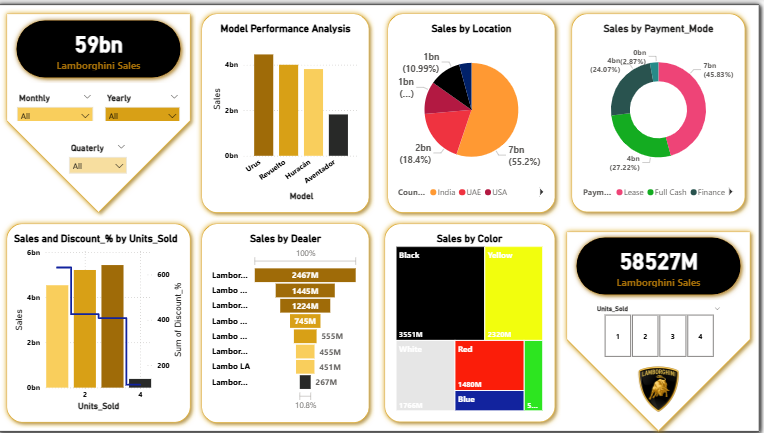

# 🏎️ Lamborghini Sales Dashboard

This project presents a comprehensive Power BI dashboard analyzing Lamborghini sales performance across different dimensions such as model, color, location, payment mode, and dealership.

## 📊 Dashboard Highlights

- **Total Sales**: `59bn` in revenue
- **Units Sold**: `58,527` units
- **Top Performing Model**: Urus
- **Sales by Region**:
  - USA: 55.2%
  - UAE: 18.4%
  - India: 10.99%
- **Preferred Payment Mode**:
  - Finance: 45.83%
  - Full Cash: 27.22%
  - Lease: 24.07%
- **Popular Car Colors**:
  - Yellow
  - Black
  - Red
- **Top Dealer**: Lamborghini NY with 2467M in sales

## 📁 Files Included

- `Lamborghini_data.csv`: Raw sales dataset.
- `Lamborghini.png`: Power BI dashboard image.
- `README.md`: Project overview.

## ⚙️ Features Analyzed

- **Sales by Model**: Performance of different models including Urus, Revuelto, Huracan, Aventador.
- **Sales by Location**: Regional performance segmented by country.
- **Sales by Dealer**: Comparative analysis of dealership sales.
- **Sales by Color**: Consumer preferences based on car color.
- **Sales by Payment Mode**: Analysis of financing trends.
- **Discounts and Units Sold**: Correlation between discount rates and units sold.

## 📌 Filters Available in Dashboard

- **Monthly**, **Quarterly**, **Yearly** time filters
- Dynamic drilldown by:
  - Model
  - Units sold
  - Location
  - Dealer
  - Payment mode
  - Color

## 🔧 Tools Used

- **Power BI**: For data visualization and dashboard creation.
- **CSV**: For structured data storage.

## 📈 Purpose

The dashboard provides clear insights to Lamborghini's sales teams, marketing analysts, and executives for better decision-making based on visualized KPIs and regional performance.

---

## 📬 Contact

For questions or suggestions, feel free to open an issue or contact the repository maintainer.

